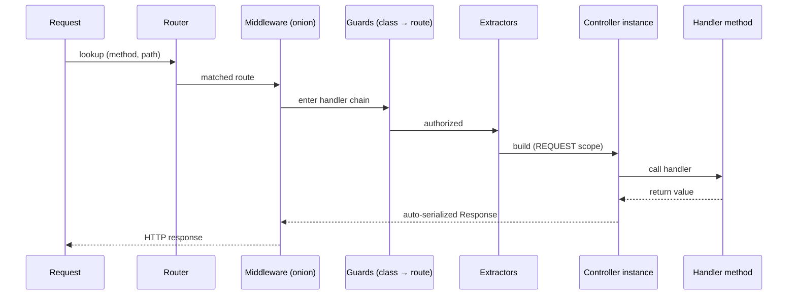

# Controllers

> A controller is a **class** that groups HTTP route handlers under a common URL prefix. Lauren uses class-based controllers (not free functions) because handlers naturally share dependencies, configuration, guards, and middleware.

## Anatomy of a controller

```python
from lauren import controller, get, post, Path, Json

@controller("/users", tags=["users"])
class UserController:
    def __init__(self, repo: UserRepository, log: Logger) -> None:
        self.repo = repo
        self.log = log

    @get("/{id}")
    async def show(self, id: Path[int]) -> UserOut:
        return UserOut(**self.repo.get(id))

    @post("/")
    async def create(self, body: Json[CreateUser]) -> tuple[UserOut, int]:
        user = self.repo.create(body)
        return UserOut(**user), 201
```

What `@controller` does:

1. Attaches a `ControllerMeta(prefix="/users", tags=["users"], ...)` payload to the class.
2. **Auto-marks the class as `@injectable(scope=Scope.REQUEST)`** if it isn't already injectable. This is what lets controllers take request-scoped deps (e.g. a `DbSession`) in their constructor.
3. Registers no routes by itself — the route decorators (`@get`, `@post`, ...) on the methods do that. `@controller` only sets the prefix and groups them.

## What a controller does

* **Routes requests** — every method decorated with `@get`/`@post`/`@put`/`@patch`/`@delete`/`@head`/`@options` becomes an HTTP handler at `prefix + path`.
* **Receives DI** — constructor parameters are resolved through the container (request-scoped by default).
* **Composes guards and middleware** — class-level decorators apply to every method; route-level ones compose on top.
* **Surfaces metadata to OpenAPI** — `tags`, `summary`, `description`, `deprecated`, and `security` flow into the generated schema.

## What a controller does **not** do

* **It does not subclass anything.** No `Controller` base class. No mixins required.
* **It does not "inherit" from another controller.** Subclassing a `@controller` class **does not** propagate the controller status to the subclass — see [Class Inheritance Rules](inheritance.md). Method-level decorators *do* propagate (that's plain Python MRO), but you have to explicitly redecorate the subclass with `@controller(...)` for it to be registered as a controller.
* **It is not request-bound.** A controller instance lives for one request (REQUEST scope), but the *class* itself is just a registered injectable. Multiple requests build multiple instances independently.

## The route decorators

```python
@get(path="", *, summary=None, description=None, response_model=None,
     responses=None, deprecated=False, operation_id=None,
     include_in_schema=True, tags=None)
```

`@post`, `@put`, `@patch`, `@delete`, `@head`, `@options` take the same options. Multiple route decorators on the same method register multiple routes:

```python
@controller("/p")
class PingController:
    @get("/ping")
    @get("/health")               # same handler, two routes
    async def ping(self) -> dict:
        return {"ok": True}
```

## Class-level guards and middleware

Guards and middleware can attach to the controller class — they apply to **every handler** defined on it. Route-level guards/middleware compose on top, with the **class running first**.

```python
@use_guards(AuthenticatedGuard)
@controller("/private")
class PrivateController:
    @get("/")
    async def index(self) -> dict: ...        # AuthenticatedGuard runs

    @get("/admin")
    @use_guards(AdminGuard)
    async def admin(self): ...                # AuthenticatedGuard, then AdminGuard
```

Both decoration orders work for class-level decorators — Lauren accepts:

```python
@use_guards(AuthGuard)         # outer
@controller("/x")
class A: ...

@controller("/x")              # outer
@use_guards(AuthGuard)
class B: ...
```

## DI inside controllers

Because `@controller` implies `@injectable(scope=Scope.REQUEST)`, the constructor can take **any** combination of `SINGLETON` or `REQUEST` deps:

```python
@injectable(scope=Scope.SINGLETON)
class Clock: ...

@injectable(scope=Scope.REQUEST)
class DbSession: ...

@controller("/orders")
class OrderController:
    def __init__(self, clock: Clock, session: DbSession) -> None:
        self.clock = clock
        self.session = session    # fresh DbSession per request
```

The container also resolves Protocol-typed dependencies, multi-bindings (`list[Sender]`), and `Annotated[T, Inject("token")]` for non-class tokens — see [Custom Providers](../guides/custom-providers.md).

## Inheritance, briefly

> **Lauren does not auto-inherit `@controller` status.** Decorate every subclass explicitly.

```python
@controller("/a")
class A:
    @get("/idx")
    async def idx(self): ...

class B(A):
    pass    # not a controller — registering it raises MetadataInheritanceError

@controller("/b")
class B2(A):
    pass    # OK — A.idx is inherited via MRO and registered under /b/idx
```

Method decorators *do* propagate (because that's just how Python attribute lookup works), but you must explicitly redecorate the subclass to opt it into being a controller. Read the full justification in [Class Inheritance Rules](inheritance.md).

## A controller's role in the dispatch graph



The controller instance is created **after** middleware has wrapped the call and **after** guards have authorized — you don't pay the constructor cost on rejected requests.

Continue to [Injectables & Providers →](injectables.md).
