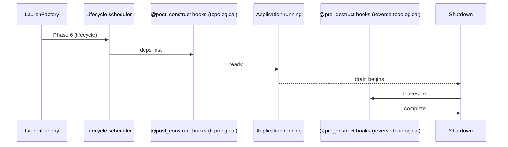

# Lifecycle Hooks

> Lauren runs your providers' lifecycle hooks **deterministically** — `@post_construct` in topological order at startup, `@pre_destruct` in reverse topological order at shutdown, both with bounded timeouts.

## The two hooks

```python
from lauren import injectable, post_construct, pre_destruct

@injectable()
class Db:
    @post_construct
    async def connect(self) -> None:
        self.pool = await asyncpg.create_pool("...")

    @pre_destruct
    async def disconnect(self) -> None:
        await self.pool.close()
```

Hooks may be `async def` or plain `def`. The lifecycle scheduler awaits coroutine results and runs sync hooks directly.

## When they run



* **Startup** — phase 6 of `LaurenFactory.create(...)`. Singletons are constructed, then `@post_construct` hooks run in **topological order** (a dependency's hook completes before its dependent's hook starts).
* **Shutdown** — `app.shutdown(drain_timeout=...)` runs in four logged phases: drain in-flight requests, run `on_shutdown` callbacks (LIFO), then run `@pre_destruct` hooks in **reverse topological order** (dependents teardown first).

## Topological ordering, with a picture

If your DI graph is `Db ← Repo ← Service`, the timeline looks like this:

```
Startup    (build):  Db → Repo → Service
@post_construct:     Db.connect → Repo.warm → Service.preload

Shutdown   (drain):  Service.flush → Repo.close → Db.disconnect
```

This is what makes lifecycle ordering *correct*: a `Repo` whose `@post_construct` hook expects `Db.pool` to exist will always find it, because `Db.connect` ran first. At teardown, `Repo` lets go of its handle to `Db` before `Db.disconnect` closes it.

## Timeouts and best-effort teardown

`@pre_destruct` hooks run with a per-hook timeout. If one hangs, Lauren logs a `DestructTimeoutError`, abandons that hook, and moves on to the next. **Teardown never aborts halfway through** — every other hook still runs.

```python
await app.shutdown(drain_timeout=10.0)   # drain phase capped at 10s
```

Inside the four-phase shutdown:

| Phase | Bounded by | What runs |
|---|---|---|
| Drain | `drain_timeout` | In-flight requests get a chance to finish. |
| `on_shutdown` callbacks | per-callback timeout | User hooks registered via `app.on_shutdown(fn)` (LIFO order). |
| `@pre_destruct` hooks | per-hook timeout | Provider teardown in reverse topological order. |
| Goodbye | — | Final log line confirming clean shutdown. |

Failures inside any callback or hook are captured as `DestructError` and logged, but do not block the remaining cleanup.

## Practical patterns

### Open a connection pool at startup, close it at shutdown

```python
@injectable()
class Db:
    pool: asyncpg.Pool | None = None

    @post_construct
    async def open(self) -> None:
        self.pool = await asyncpg.create_pool(DSN)

    @pre_destruct
    async def close(self) -> None:
        if self.pool:
            await self.pool.close()
```

### Warm a cache after dependencies are ready

```python
@injectable()
class TemplateRegistry:
    def __init__(self, fs: FileSystem) -> None:
        self.fs = fs
        self.tpl: dict[str, str] = {}

    @post_construct
    async def warm(self) -> None:
        for path in await self.fs.list("/templates"):
            self.tpl[path] = await self.fs.read(path)
```

### Flush a metrics queue at shutdown

```python
@app.on_shutdown
async def flush_metrics() -> None:
    await metrics_client.flush()
```

`on_shutdown` callbacks run **before** `@pre_destruct` hooks, so the metrics client is still alive when `flush_metrics` calls it.

### Per-request resource cleanup with `aclose`

Request-scoped injectables can declare an `aclose` (or `__aexit__`-style) method. Lauren awaits it after every request automatically:

```python
@injectable(scope=Scope.REQUEST)
class DbSession:
    def __init__(self, db: Db) -> None:
        self.session = db.pool.acquire()

    async def aclose(self) -> None:
        await self.session.release()
```

## Errors and edge cases

| Error | When it fires |
|---|---|
| `LifecycleConfigError` | A hook is declared on a non-injectable, or on a method with the wrong signature. |
| `LifecycleViolationError` | A `@post_construct` is declared on a transient-scoped provider (it would fire on every resolve). |
| `DestructError` | A `@pre_destruct` hook raised an exception; collected and logged. |
| `DestructTimeoutError` | A `@pre_destruct` hook exceeded its per-hook timeout. |
| `DrainTimeoutError` | The drain phase exceeded `drain_timeout`. |

All of them are emitted through the structured logger, so production aggregators see them as JSON records you can alert on.

## Best practices

* **Keep `@post_construct` cheap.** Anything that can fail and might need retry belongs in a separate "warm" step you can re-run, not in startup.
* **Use `on_shutdown` for things that aren't owned by a provider** — flushing a global metrics client, sending a "we're shutting down" event to a service registry, closing a side-channel connection.
* **Use `@pre_destruct` for provider-owned resources** — connection pools, file handles, subprocesses. These mirror the `@post_construct` that opened them.
* **Don't depend on order between `on_shutdown` callbacks and `@pre_destruct` hooks**, except that all callbacks run before any hooks. Within each phase, registration order (LIFO) and topology decide.

Continue to [Request & Response →](request-response.md).
