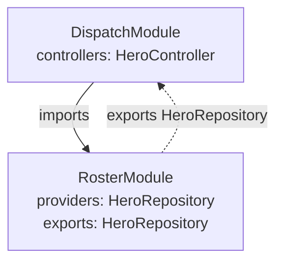

# 4. Assembling Teams

> HQ is growing. Soon you'll have a roster team, a dispatch desk, a security detail, and
> a mission-control room. Cramming them all into one `AppModule` is how you get a 2,000-line
> file nobody wants to open. Time to assemble teams.

!!! abstract "📋 Mission briefing"
    **You'll build:** a `RosterModule` and a `DispatchModule` with explicit boundaries.
    **You'll learn:**

    - [ ] What a `@module` really is (spoiler: a superhero team)
    - [ ] `providers`, `controllers`, `imports`, and `exports`
    - [ ] How module boundaries control what's visible to whom

---

## A module is a team

In Lauren, a `@module` is a unit of composition with a clear contract. It declares:

- `controllers` — the routes it owns,
- `providers` — the services it can build,
- `exports` — the providers it lets *other* teams use,
- `imports` — the other teams whose exports it wants.

That's the whole superhero-team metaphor, and it's not even a stretch: a team has its own
members (providers), does its own jobs (controllers), shares a few specialists with allied
teams (exports), and calls in backup from teams it trusts (imports).

---

## Split HQ into two teams

First, give the front desk its own file. Nothing about the controller changes — it just
moves out of `main.py`:

```python title="hero_hq/dispatch.py"
from lauren import Json, Path, controller, get, post
from lauren.exceptions import HTTPError

from .models import CreateHero, HeroOut
from .roster import HeroRepository


class HeroNotFoundError(HTTPError):
    status_code = 404
    code = "hero_not_found"


@controller("/heroes", tags=["heroes"])
class HeroController:
    def __init__(self, roster: HeroRepository) -> None:
        self.roster = roster

    @get("/")
    async def list_heroes(self) -> list[HeroOut]:
        return [HeroOut(**hero) for hero in self.roster.roster()]

    @get("/{id}")
    async def get_hero(self, id: Path[int]) -> HeroOut:
        hero = self.roster.get(id)
        if hero is None:
            raise HeroNotFoundError("no such hero", detail={"id": id})
        return HeroOut(**hero)

    @post("/")
    async def recruit(self, body: Json[CreateHero]) -> tuple[HeroOut, int]:
        hero = self.roster.recruit(body.name, body.power, body.wattage)
        return HeroOut(**hero), 201
```

Now declare the teams. The **roster team** owns the `HeroRepository` and *exports* it so
other teams may use it. The **dispatch team** owns the controller and *imports* the roster
team to get at it:

```python title="hero_hq/teams.py"
from lauren import module

from .dispatch import HeroController
from .roster import HeroRepository


@module(providers=[HeroRepository], exports=[HeroRepository])
class RosterModule:
    """Owns and shares HQ's roster."""


@module(controllers=[HeroController], imports=[RosterModule])
class DispatchModule:
    """The dispatch desk — imports the roster team to do its job."""
```

Finally, point the factory at the top-level team:

```python title="hero_hq/main.py"
from lauren import LaurenFactory

from .teams import DispatchModule


def build_app():
    return LaurenFactory.create(DispatchModule, docs_url="/docs", openapi_url="/openapi.json")


app = build_app()
```

---

## The HQ org chart

Here's who reports to whom. `DispatchModule` imports `RosterModule`; `RosterModule` exports
the one provider the dispatch desk needs:



!!! tip "⚡ Hero Tip"
    `exports` is a deliberate door, not an open floor plan. If `RosterModule` didn't export
    `HeroRepository`, the dispatch desk couldn't inject it — and Lauren would tell you so at
    startup with a `ModuleExportViolation`, naming exactly what's missing. Encapsulation you
    can't accidentally break.

!!! danger "💥 Villainous Pitfall"
    Importing a module is not the same as exporting its providers. If `DispatchModule` later
    needs to re-share `HeroRepository` with a *third* team, it must list it in its own
    `exports` — imports don't transitively leak. Boundaries stay where you draw them.

---

## ✅ Checkpoint

```text
hero_hq/
├── models.py      # CreateHero, HeroOut
├── roster.py      # HeroRepository (@injectable SINGLETON)
├── dispatch.py    # HeroController + HeroNotFoundError
├── teams.py       # RosterModule (exports) + DispatchModule (imports)
└── main.py        # build_app() + app
```

**What changed:** one crowded `AppModule` became two focused teams with an explicit,
startup-enforced boundary. Everything still works exactly as before — `curl` your routes and
see — but HQ is now ready to grow without becoming a single unreadable file.

This is the app you'll keep building on. The full, tested source is in
[`docs/tutorial/hero_hq/`](https://github.com/lauren-framework/lauren-framework/tree/main/docs/tutorial/hero_hq).

---

**Next:** Steps 5–9 are on the way — the Door Bouncer (guards & auth), sessions, Mission
Control (real-time), testing, and shipping to production.
**Go deeper:** [Modules](../core-concepts/modules.md) ·
[Circular Module Imports](../guides/circular-module-imports.md)
